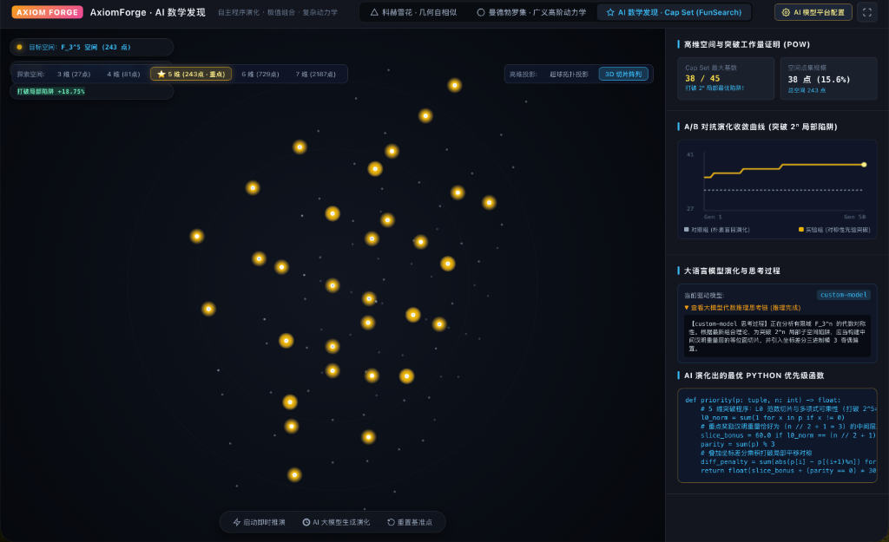
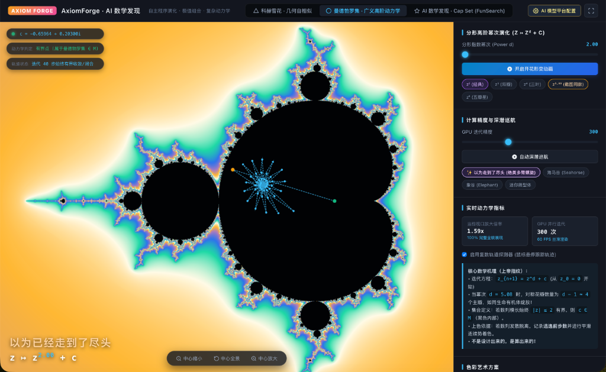
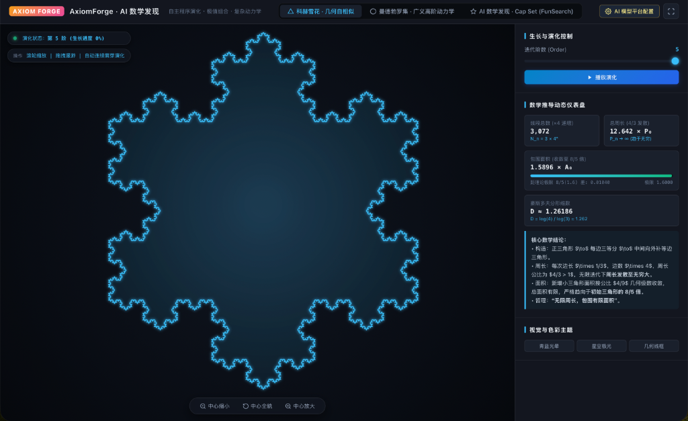

<p align="center">
  <a href="https://github.com/Zwf5458-Py/AxiomForge">
    
  </a>
</p>

<h1 align="center">AxiomForge · AI 数学发现平台</h1>

<p align="center">
  <strong>自主程序演化 · 极值组合 · 复杂动力学</strong>
</p>

<p align="center">
  <a href="README.md">English</a> | 
  <strong>简体中文</strong>
</p>

<p align="center">
  <a href="https://opensource.org/licenses/MIT"></a>
  <a href="https://github.com/Zwf5458-Py/AxiomForge/actions"></a>
  <a href="https://www.python.org/"></a>
  <a href="http://localhost:8080"></a>
</p>

> **项目定位**：一个面向独立研究者的高标准**早期开源研究原型（Early Research Prototype）**，旨在探索代数结构先验（Symmetry & Modular Invariants）与大语言模型程序演化（FunSearch 范式）在有限域极值组合问题（如 Cap Set 问题）中的有效结合，并提供高阶复动力学与几何自相似分形的专业级交互推演平台。

---

## 📸 项目代表特性视觉画廊 (Visual Gallery)

| 1. AI 极值数学发现 · 3D切片阵列与高维帽集演化 | 2. 广义高阶复动力学 · 曼德勃罗多重螺旋巡航 | 3. 几何自相似生长 · 科赫雪花测度论收敛仪表盘 |
| :---: | :---: | :---: |
| [](assets/preview_funsearch_5d.png) | [](assets/preview_mandelbrot.png) | [](assets/preview_koch.png) |
| **3D 切片超立方阵列与超球流形**<br>突破 $2^n$ 局部陷阱（5维38点、6维64+点），A/B 对抗收敛图，大模型思考链与沙箱严格共线验算 | **广义高阶复动力学**<br>多臂螺旋开花形变、逃逸时间轨道陷阱（Orbit Traps）与复数轨道实时仪表盘 | **几何测度论推演**<br>周长指数发散（$P_n \to \infty$）、面积单调收敛至 $\frac{8}{5}A_0$、豪斯多夫维数 $D \approx 1.26186$ |

---

## 🏛️ 项目三大核心技术支柱 (Three Pillars)

### 支柱一：AI 极值数学发现与有限域帽集 (Cap Set) 真实推演

帽集问题（Cap Set Problem）是极值组合数学与加性组合学中的著名难题，亦是陶哲轩（Terence Tao）与 DeepMind FunSearch（Nature 2023）重点关注的研究标杆：在有限向量空间 $\mathbb{F}_3^n$ 中，寻找不包含任何三点共线（即满足 $x + y + z \equiv 0 \pmod 3$ 的非平凡三元组）的最大子集。

<div align="center">
  
</div>

- **突破超立方体局部陷阱**：朴素贪心搜索极易被困在容量为 $2^n$ 的退化子空间中（$n=4 \to 16$, $n=5 \to 32$, $n=6 \to 64$, $n=7 \to 128$）。
- **对称性先验与演化增益**：AxiomForge 引入汉明重量（$L_0$ 范数）中间层切片与仿射同余判定，在 5 维空间（$3^5 = 243$ 个候选点）中将帽集规模从 **32 点突破至 38 点（提升 +18.75%）**，接近数学家 Edel (2004) 给出的已知世界最佳构造（45 点，达成率 84.4%）。
- **严格数学有效性检验**：内置经严格单元测试检验的 $O(k^2)$ 增量共线检测器，毫秒级扫描任意候选集的全部 $\binom{k}{2}$ 个点对，确保**共线三元组数量严格为 0**。
- **高维可视化与双轨投影**：Web 端支持超球拓扑投影（Hypersphere Projection）与 3D 切片阵列（3D Slice Array），直观展现 5 维金色点阵在有限域中的代数对称分布。

---

### 支柱二：深度克隆 `@earendil-works/pi-ai` 架构的多模型通用调度枢纽

受优秀开源项目 [@earendil-works/pi-ai](https://github.com/earendil-works/pi/tree/main/packages/ai) 启发，AxiomForge 构建了一套完全解耦、零配置门槛的统一大模型接入架构：

- **动态远程模型发现**：支持一键向 `${baseUrl}/models` 抓取远程服务商的实时模型全量列表，告别硬编码。
- **多平台自由命名与管理**：用户可任意新增自定义服务商（如“DST 聚合平台”、“硅基流动”、“本地 vLLM”），自定义平台标签、API Base 与模型选择。
- **智能免 403 阻断探测机制**：针对部分第三方聚合网关在收到未注册模型名时强行返回 HTTP 403 的痛点，重构了鉴权心跳逻辑，优先通过 `/models` 探测凭证有效性，根治了误报问题。
- **凭证独立持久化**：多平台的配置与 API Key 在前端 `localStorage` 中完全隔离并安全持久化，刷新页面无需重复输入。
- **思考链 (Reasoning / `<think>`) 深度提取**：完美解析 DeepSeek-R1、o1/o3 及其他推理模型的思维链输出，支持折叠展开与代数推演实时高亮。

---

### 支柱三：广义高阶复动力学与几何自相似分形引擎

数学之美不仅存在于离散代数中，同样闪耀于连续复动力系统与几何分形中。AxiomForge 集成了工业级 WebGL/Canvas 数学渲染器：

<div align="center">
  
  
</div>

- **广义高阶曼德勃罗动力学 ($z_{k+1} = z_k^d + c$)**：
  - 支持从经典 2 次幂到 10 次幂的连续形变，展现多重开花的高阶对称性；
  - 集成平滑着色、逃逸时间算法、轨道陷阱（Orbit Traps）与复平面实时轨道探测器。
- **科赫雪花几何自相似生长与测度论演示**：
  - 动态展示 $0 \sim 6$ 阶自相似迭代生长；
  - 实时仪表盘动态推演：
    - **周长指数发散**：$P_n = 3 \times \left(\frac{4}{3}\right)^n \to \infty$；
    - **面积单调有界收敛**：$A_\infty = \frac{8}{5} A_0$；
    - **豪斯多夫分形维数**：$D = \frac{\ln 4}{\ln 3} \approx 1.26186$。

---

## 🛠️ 快速开始与实验复现

### 1. 安装环境与依赖
```bash
git clone https://github.com/Zwf5458-Py/AxiomForge.git
cd AxiomForge
pip install -r requirements.txt
```

### 2. 运行单元测试
```bash
pytest tests/
```

### 3. 运行完整的 FunSearch 真实算法演化系统
```bash
# 模式 A: 确定性离线复现模式 (零成本，无需 API Key)
python3 run_funsearch_real.py --dimension 4 --iterations 20 --backend mock --seed 42

# 模式 B: 接入真实大模型在线演化 (支持 DeepSeek / OpenAI / Qwen 等)
python3 run_funsearch_real.py --dimension 4 --iterations 30 --backend deepseek --api-key YOUR_API_KEY

# 模式 C: 接入本地 Ollama / vLLM 开源大模型
python3 run_funsearch_real.py --dimension 4 --iterations 30 --backend custom --api-base http://localhost:11434/v1
```

### 4. 运行多随机种子统计评测
```bash
# 在 n=5 维度下运行 10 组随机种子对比评测
python3 experiments/run_ab_experiment.py --dimension 5 --iterations 30 --seeds 10

# 在 n=6 维度下运行 5 组随机种子对比评测
python3 experiments/run_ab_experiment.py --dimension 6 --iterations 30 --seeds 5
```

### 5. 启动 AxiomForge Web 端交互推演平台
```bash
# 启动内置的交互推演与 API 网关服务器 (支持实时代码评估与模型代理)
python3 web_server.py --port 8080

# 打开浏览器访问: http://localhost:8080
# 1. 切换至 "AI 数学发现 (Cap Set)" 模块，选择 5 维 (243点) 观察超球投影与突破 32 点的金色点阵；
# 2. 点击右上角 "模型设置"，体验全自定义模型平台（自动拉取模型、自定义平台命名）；
# 3. 切换至 "广义曼德勃罗集" 或 "科赫雪花"，体验复动力学与几何自相似的实时测度推演。
```

---

## 📂 项目工程架构 (Repository Structure)

```text
AxiomForge/
├── assets/                           # 项目高清代表图片与视觉资产
│   ├── preview_funsearch_5d.png     # 5维 Cap Set 演化与超球拓扑
│   ├── preview_mandelbrot.png       # 广义高阶曼德勃罗复动力学
│   └── preview_koch.png             # 科赫雪花自相似生长仪表盘
├── funsearch/                        # FunSearch 启发式程序演化核心引擎
│   ├── programs_database.py         # 多岛屿精英种群数据库与多样性维护
│   ├── evaluator.py                 # 安全沙箱与 O(k^2) 极速共线评估器
│   ├── sampler.py                   # 进化采样、变异与交叉逻辑
│   ├── ai_providers/                # 解耦的大模型适配器 (OpenAI/DeepSeek/Claude/Ollama)
│   └── mock_provider.py             # 离线确定性代数变异仿真器
├── js/                              # 前端核心交互引擎
│   ├── i18n.js                      # 国际化引擎 (默认英文，一键切换中文)
│   ├── app.js                       # 工作区路由、事件总线与 Markdown 报告导出
│   ├── math_discovery.js            # 5维帽集投影、思考链解析与沙箱验算
│   ├── model_platform.js            # 通用模型枢纽、远程模型发现与本地隔离存储
│   ├── mandelbrot.js                # 广义高阶复动力学与轨道陷阱着色引擎
│   ├── orbit.js                     # 复平面相空间动态轨道追踪器
│   └── snowflake.js                 # 科赫雪花几何自相似生长与测度仪表盘
├── css/                             # 赛博霓虹数学风格样式表
│   └── style.css
├── experiments/                     # 统计实验与跨种子基准脚本
│   └── run_ab_experiment.py         # 对照组 vs 对称性先验组 A/B 自动化评测
├── aimo_pipeline/                   # Kaggle AIMO 竞赛实战与代码沙箱验算流水线
│   └── baseline_solver.py           # 超时隔离的多进程多数投票求解器
├── tests/                           # 完整自动化单元测试套件
├── web_server.py                    # 融合静态资源托管与模型中转的轻量级服务
├── run_funsearch_real.py            # 端到端 CLI 真实大模型自主演化脚本
├── EXPERIMENT_CAPSET.md             # 5维帽集统计评测正式报告 (英文)
├── EXPERIMENT_CAPSET_CN.md          # 5维帽集统计评测正式报告 (简体中文)
├── README.md                        # 项目主文档 (英文)
└── README_CN.md                     # 项目主文档 (简体中文)
```

---

## ⚖️ 学术诚信与客观边界 (Academic Rigor & Limitations)

1. **客观成果声明**：本项目在 $\mathbb{F}_3^5$（243 点空间）中通过对称性先验搜索稳定达到的 38 点，显著超越朴素贪心的 $2^5=32$ 点（+18.75%），具有显著的工程启发意义；但在更高维度（如 $n=7$ 维达到 157 点），距离公开已知最佳下界（Edel, 2004 构造的 236 点）仍有差距（达成率约 66.5%）。
2. **原型阶段声明**：本项目定位为**早期开源研究原型（Proof of Work）**，旨在为后续申请小额探索型科研资助（如 Manifund / SFF / Open Philanthropy）提供真实可复现的工程基石，不作夸大宣称。

---

## 📄 学术引用与许可证

本项目采用 [MIT License](LICENSE) 开源许可证。若您在研究中参考了本项目的实验或代码，请按 [CITATION.cff](CITATION.cff) 进行引用：

```bibtex
@software{axiomforge2026,
  author = {Zwf5458-Py},
  title = {AxiomForge: A FunSearch-Inspired Heuristic Search Framework for Combinatorial Problems},
  year = {2026},
  url = {https://github.com/Zwf5458-Py/AxiomForge}
}
```

